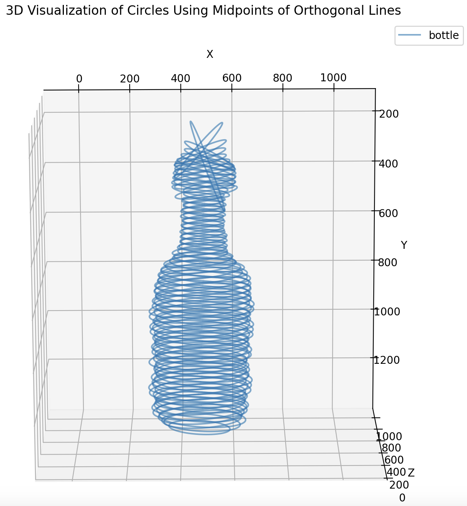

# Project: 3D Volume Estimation by leveraging instance seegmentation results on 2D images

3D Circles where each has the diameter of an orthogonal line at a specific position on the middle line of the object.

**Which steps are performed?**:
1. **Instance Segmentation**:
    * Instance segmentation is performed on 2D images using a pre-trained YOLOv8seg model.
    * For specific object classes a fine-tuned model can be used.
    * The model is trained on the COCO dataset.
    * The model is used to predict the instances in the input image.
    * The instances are saved as masks and bounding boxes.
2. **Skeletonization**:
    * The objects are skeletonized by computation of CoG from consecutive segments
    * The CoGs can be used to define the middle line of the object (polnom regression/interpolation, with/without parametrics ordering of the points)
    * By using the objects middle line we can define orthogonal lines to the middle line that are cut off at the object's boundary (2nd usage of the instance segmentation masks)
3. **Volume Estimation**:
    * The orthogonal lines are used to estimate the volume of the object.
    * The volume is estimated by the sum of the areas of the orthogonal lines multiplied by the distance between the lines.
    * The volume is visualized in a 3D plot.

Optional: **Conversion from pixel^3 to mm^3**:
* The volume can be converted from pixel^3 to mm^3 by using a parameter k (unit pixel/mm).
* This parameter can be calculated by measuring a reference object with known volume or by using the magnification of the camera lense (tutorial coming soon).

**Volume Estimation Settings**: 
Users can set parameters for volume estimation, such as 
* millimeters per pixel
* fallback polynomial degree
* and the number of orthogonal lines

Presents a skeletal image with orthogonal lines and a 3D volume visualization.
